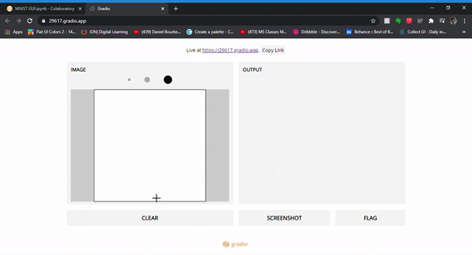

# MINST-GUI
Handwritten Digit Recognition GUI

## Demo

## About
- The aim of this Assignment was develope a minst model which can recognise hand written digits and then integrate with an inline GUI(Gradio). 

## What is Gradio

- Gradio allows you to quickly create customizable UI components around your TensorFlow or PyTorch models, or even arbitrary Python functions. Mix and match components to support any combination of inputs and outputs. Our core library is free and open-source!

## MNIST_GUI.ipynb 
It contains the source code where we trained our model using 2 hidden layers of neural network and then fit the model and used the model in the gradio interface 
- Gradio outputs the GUI interface along with a live web link which is active for 6 hours of compilation which u can share with your family and friends.
